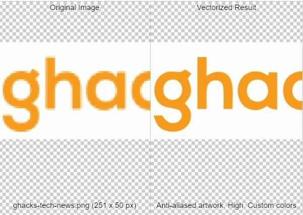

# Grupo 5


Nuestro programa procesa imágenes convirtiéndolas en formato SVG para su uso online en páginas web ofreciendo así gráficos con calidad al ser escalables.

## Motivación

El formato SVG tiene soporte desde hace mucho tiempo para todo tipo de navegadores web. El hecho de trabajar con vectores escalables hace que las imágenes en páginas web con este formato conseguido no pierdan calidad a la hora de darle zoom y tiene gran flexibilidad al poder trabajar en conjunto con el estilo dado por CSS.
  
 

## Objetivos:
  * Procesamiento de imágenes
  
  Poder convertir imágenes identificando los pixeles más relevantes que darán forma a la imagen final en formato SVG
  
  * Fijar calidad de imágenes

  Al convertir la imagen en formato SVG, a pesar de darle zoom y ser un vector escalable, la calidad no se perderá.

  * Poder personalizar los colores de las imágenes procesadas

  Una vez convertido en formato SVG y obtenerlo en el código HTML, mediante CSS poder estilizar las imágenes.

## Integrantes: 
  
  Lamentablemente no participaron todos los integrantes, solo los siguientes:
  
  + Joao Franco Emanuel Chávez Salas jchavezsa@unsa.edu.pe
  
  + John Edson Sanchez Chilo jsanchezchi@unsa.edu.pe
.
## 🔧 Licencia: APACHE  2.0 


## Requisitos 🛠️
  * C++ 
  * OpenCv 
  * Visual Studio Code

### Instalación en Windows

+ Primero deben ingresar al siguiente enlace: https://opencv.org/releases/

+ Descargar la version de opencv 4.5.5 dando clic en el ícono de Windows.
  
+ Luego ingresar a este enlace: https://cmake.org/download/

+ Buscar entre las distribuciones binarias de la última versión y comprobar que en la plataforma diga "Windows x64 Installer:" y descargar el instalador de Cmake en formato .msi en su versión 3.24.1

+ Una vez instalados, debemos agregar las rutas a nuestras variables de entorno de las siguientes carpetas:

* C:\opencv\build\x64\vc15\bin
* C:\opencv\build\x64\vc15\lib
* C:\Program Files\CMake\bin

+ Por último necesitamos instalar Visual Studio Code desde el siguiente enlace: https://code.visualstudio.com/download y seleccionando el ícono de Windows.

+ Luego descargaremos todas las carpetas que contiene el proyecto en github y las colocaremos en una sola carpeta

+ Abrimos Visual Studio Code y seleccionamos en el menú superior la opción "Archivo" y luego "Abrir carpeta".

+ Seleccionamos la carpeta donde guardamos todos los archivos del proyecto.

+ A continuación tenemos que instalar las siguientes extensiones en Visual Code Studio.

* C/C++ (Microsoft).
* C/C++ Compile Run (danielpinto8zz6).
* CMake (twxs).
* CMake Tools (Microsoft).

+ Regresar a donde se encuentra nuestros archivos del proyecto dentro de Visual Studio Code y presionar la siguiente combinación de teclas: Shift + Ctrl + P y escribir "Cmake Configure.

+ Elegir el compilador que solemos utilizar para c++, en este caso será "Visual Studio Community 2019 Release - x86_amd64".

+ Nos aparecerá una caja de texto en la parte inferior derecha, debemos seleccionar la opción "Crear" y nos pedirá poner el nombre del proyecto, el mismo nombre debe ser al que nos referimos líneas abajo como "Nombreproyecto" y copiar todos los archivos de la carpeta del proyecto de software.

+ Luego seleccionar en "ejecutable" y nos abrirá la configuración del CMake en la que tenemos que tener las siguientes líneas de código:

```
cmake_minimum_required(VERSION 3.0.0)
project(opencv VERSION 0.1.0)

include(CTest)
enable_testing()

find_package(OpenCV REQUIRED)
include_directories(${OpenCV_INCLUDE_DIRS})

add_executable({Nombreproyecto} main.cpp program.h image_matrix.h converter.h)

target_link_libraries( {Nombreproyecto} ${OpenCV_LIBS} )

set(CPACK_PROJECT_NAME ${PROJECT_NAME})
set(CPACK_PROJECT_VERSION ${PROJECT_VERSION})
include(CPack)
```


### Ejecución del código

+ Al compilar el proyecto como primera instrucción pedirá ingresar la ruta de la imagen.

+ Luego tendremos el menú con varias opciones intuitivas.

+ Según las opciones podrás recortar verticalmente u horizontalmente o convertir directamente a código SVG.

+ Seguido de eso podemos pegar ese código en el cuerpo del archivo HTML llamado index.html que también descargamos del proyecto.

+ Al copiar el resultado entre las etiquetas <svg></svg> y luego guardar el archivo .html, podremos ejecutarlo y ver en nuestro navegador predeterminado cómo se ve la imagen en la web. 

+ Asegurarnos que la etiqueta <path> tenga la clase "imagen" para que puedan funcionar los estilos.


